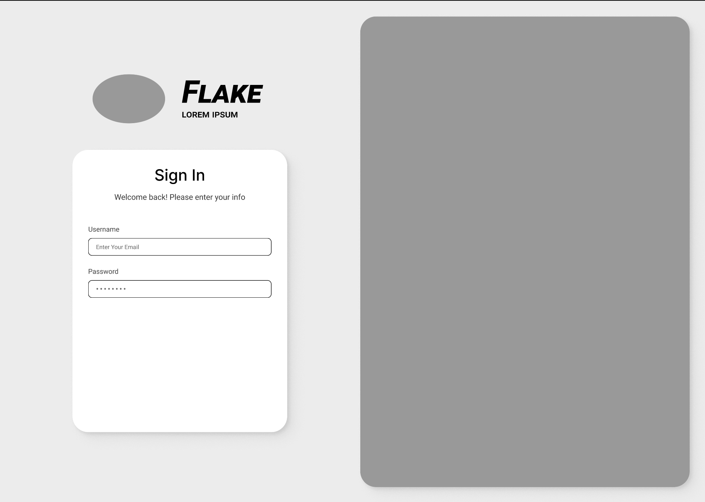
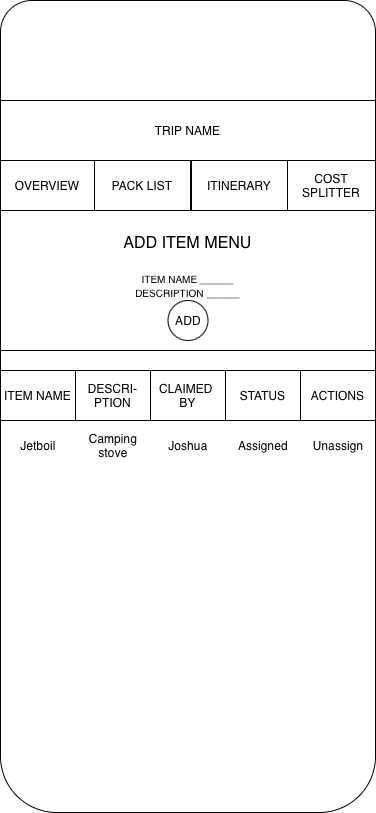
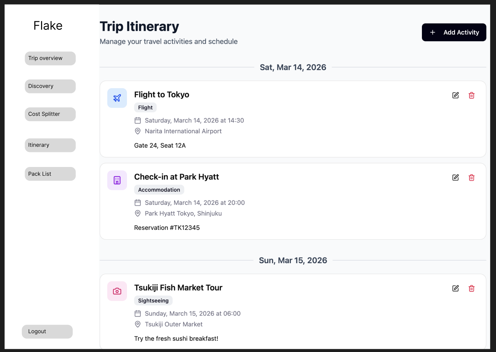

# Flake Web Pages Design

This document defines the pages Flake will implement, what data each page needs to render, and how to verify that each page works correctly.

---

## Conventions Used in This Document

### Parameter Types
- **Route params**: values embedded in the URL path (e.g., `/trips/:tripId`)
- **Query params**: values appended to the URL after `?` (e.g., `?trip_id=1`)

### Data Types
- **Auth state**: the current user's identity, derived from the stored JWT token
- **API data**: data fetched from the Flask backend
- **UI state**: transient values managed by the frontend, such as form fields and selected items

### Mockups
Each page includes a low-fidelity mockup. Mockups are either an image file or an ASCII wireframe.

---

# 1) Login Page

## Page Title
Login

## Page Description
Purpose: Allow existing users to log in to their Flake account. The page displays the Flake branding, a sign-in form with username and password fields, and a graphic/image panel to the right. Submitting the form authenticates the user and redirects them to the dashboard.

**Mockup (low-fidelity):**



## Parameters Needed for the Page
- Route params: none
- Query params (optional): `redirect` - path to redirect to after successful login

## Data Needed to Render the Page
- Auth state: none (guest only page)
- API data:
  - `POST /api/auth/login` → log in with username and password, returns `access_token`, `refresh_token`
- UI state:
  - username field
  - password field
  - error message

## Link Destinations for the Page
- Dashboard → `/dashboard` (on successful login)
- Sign Up → `/signup`

## Tests for Verifying Rendering of the Page
1. **Form renders**
   - Username and password fields are present
   - Submit button is present
2. **Successful login**
   - Valid credentials call `POST /api/auth/login` and redirect to dashboard
   - Access and refresh tokens are stored in the frontend auth state
3. **Failed login**
   - Invalid credentials show an error message
   - User stays on the login page
4. **Empty field validation**
   - Submitting with missing fields shows a validation error
5. **Already authenticated**
   - A logged-in user visiting this page is redirected away from login

---

# 2) Trip Overview Page

## Page Title
Trip Overview

## Page Description
Purpose: Provide users essential information of a group trip as an overview, such as description, place, date and time, members, etc

**Mockup (low-fidelity):**
```
+------------------------------------------------------+
| Flake                                                |
| "Organizing group trip is made never easier."        |
|------------------------------------------------------|
| <Basic info>                                         |
| Trip Name |  Destination | Date and time             |
| <More Details>                                       |
| Itenerary | Pack List | Events                       |
| <Members>                                            |
| All member names                                     |
|------------------------------------------------------|
| Features/Functionalities                             |
|  • View basic info about this group trip             |
|  • Redirect to more detailed pages                   |
|  • Add more people to existing member list           |
+------------------------------------------------------+
```

## Parameters Needed for the Page
- Route params: `?redirect=/trip_id`
- Query params: `?redirect=/path`

## Data Needed to Render the Page
-	Static content
    + headers
    + menus
-   Trip specific data
    + Trip description: GET /api/trips/<trip_id>
    + Member list: GET /api/members/
    + Pack list: GET /api/items
    + Date and time: GET /api/trips/<trip_id>
    + Meeting place: GET /api/trips/<trip_id>
- User actions
    + Edit member list: POST /api/members
    + Aadd/remove an event to the trip: GET /api/events
    + (stretch) assign/unassign a pack list to themselves or others

## Link Destinations for the Page
- **Itinerary** → `/trips/:itinerary`
- **Events** → `/events/:event_id`
- (Optional) Find more / Discovery → `/TBD` (if implemented)

## Tests for Verifying Rendering of the Page
1. **Page rendering**
    - headers
    - menu
    - bottoms (if imlemented)
2. **User actions**
    - Users can successfully add/delete names to member list
    - Users can successfully add/remove an event to the trip
    - (stretch) Users can successfully assign/unassign/reassign a pack list to themselves or others
3. **Redirect behavior**
   - users can be successfully redirected to intended linked pages

---

# 3) Pack List Page

## Page Title
Pack List

## Page Description
Purpose: **Pack List** allows users to _create_, _edit_, and _manage_ a shared list of gear and supplies needed for their Flake trip. Users can add items to the list then, **Assign** (or re-assign) a user as responsible for bringing an item. Users automatically **Unassign** themselves when they cancel their participation in a Flake trip.

**Mockup (low-fidelity):**



## Parameters Needed for Page
- Route params: None
- Query params (optional): `trip_id`

## Data Needed to Render Page
- Auth state: `curr_user_id`
- API data:
  - `GET /api/items?trip_id=...` → Return a list of Pack List items for a specific Flake trip, pass back `trip_id` key in query params object
  - `POST /api/items` → Create a new Pack List item associated with a specific trip, pass back `trip_id` key in query params object and pass back `cur_user_id` key in query params object
  - `PATCH /api/items/<item_id>` → Update a Pack List item (edit name, description, or assigned responsible)
  - `DELETE /api/items/<item_id>` → delete a Pack List item
  - `PATCH /api/items/<item_id>/assign` → Assign the current user as responsible for an item
  - `PATCH /api/items/<item_id>/unassign` → Unassign the current user as responsible for item and mark it as Unassigned
- UI state:
  - add-item form fields
  - selected item
  - edit-item form fields
  - list (items for trip)

## Link Destinations for the Page
- Trip Overview → `/trips/:tripId`
- Itinerary → `/trips/:tripId/itinerary`
- Cost Splitter → `/trips/:tripId/costs`

## Tests for Verifying Rendering of the Page
1. **List renders data**
   - List of Pack List items appears for the selected trip
2. **Assign behavior**
   - Clicking Assign assigns the item to the current user
3. **Save flow (for embedded form)**
   - Clicking Save calls API and shows success message
4. **Item update preview**
   - With `?item_id=...`, update preview appears and updates after save (or after fetch)
5. **Empty state**
   - If no items exist, the add-item form appears with a message about no items
6. **Delete flow**
   - Deleting an item shows a message confirming the item was deleted
7. **Unassigned item behavior**
   - Items without an owner display as **Unassigned**

---

# 4) Expenses/Cost Splitter Page

## Page Title
Expense List (Cost Splitter)

## Page Description
Purpose: Provide users with full CRUD functionality for managing trip expenses 
and real-time cost breakdowns. Users can document upfront costs to allow for 
pre-trip budget planning and ensure transparency by displaying when an expense
is shared or assigned to an individual trip member.

**Mockup (low-fidelity):**
```
+-----------------------------------------------------------------------------------------+
| Trip Expenses and Cost Splitter                                                         |
| "Manage the trip's budget before the budget trips you up ;)"                            |
|-----------------------------------------------------------------------------------------|
| [ Logout ] [ Trip Overview Link ]                                                       |
|-----------------------------------------------------------------------------------------|
|                      EXPENSES                                   |     EXPENSE FORMS     |
| Gas, 3/09/2026, Arco, $37.45                    [ Edit ] [ X ]  |                       | 
| Ice, 3/10/2026, Safeway, $7.62                  [ Edit ] [ X ]  | This Space is used    |
| Food, 3/10/2026, Safeway, $97.32                [ Edit ] [ X ]  | for the Expense Forms |
| Campsite Fee, 3/10/2026, Parks and Rec, $21.56  [ Edit ] [ X ]  |                       |
| etc.                                                            |                       |
|                                                                 |                       |
| TOTAL: $163.95                                                  |                       |
+-----------------------------------------------------------------------------------------+
| SPLITS                                                                                  | 
| Arron: $32.79   | Joshua: $32.79   | London: $32.79   |Spencer: $32.79   |Yan: $32.79   |
+-----------------------------------------------------------------------------------------+

```

## Parameters Needed for the Page
- Route params: none
- Request params: `trip_id` passed back in body of request

## Data Needed to Render the Page
- Static content
    - Page Header
    - Menu/page links
- Auth state
    - Current user_id
- API data:
    - `expenses` 
        - `GET /api/expenses` - return a list of expenses for a specific trip
            - pass back `trip_id` key in query params object
            - *→ Used by `Cost Splitter` page*
        - `POST /api/expenses` - create a new expense associated with a specific trip
            - pass back `trip_id` key in query params object
            - *→ Used by `Expense Create Form` (embedded in `Cost Splitter` page)*
        - `PATCH /api/items/<expense_id>` - edit an expense 
            - *→ Used by `Expense Edit Form` (embedded in `Cost Splitter` page)*
        - `DELETE /api/items/<expense_id>` - delete an expense
            - *→ Used by `Expense Delete Button` on `Cost Splitter` page*

    - `splits` (REACH Goal)
        - `GET /api/splits/` - return a list of splits for a specific expense
            - pass back `expense_id` in query params object
            - NOTE: `expense.splits` association can be used instead to reduce unnecessary api call
            - *→ Used by `Cost Splitter` page*
        - `POST /api/splits/` - add a split(s) for an expense
            - pass back `expense_id` in query params object
            - pass back list of `user_ids` in query params object
            - *→ Used by `Expenses POST/PATCH` routes*
        - NOTE: calculation and input of splits to be a side effect of adding or editing an expense

## Link Destinations for the Page
- Trip Overview → `/trips/:trip_id`

## Tests for Verifying Rendering of the Page

1. **Expense List Renders data**
- Logged in user is served a list of expenses for a given trip
- Logged in user can view their share of expenses as well as the shares other 
  trip members are responsible for (see #5)

2. **Add an Expense**
- Expense Create Form is embedded on the page
- Logged in user can add an expense to the trip
  - Expense can be created as shared or sole payer costs
- Adding an expense updates the expense list and shared cost splits displayed on
  the page

3. **Update an Expense**
- Expense list shows an edit button next to each expense item 
- Logged in members of the associated trip can edit expenses
- Clicking edit preloads Edit Expense Form with the expense details
  - When edit is clicked the Edit Expense Form is rendered in place of the 
    Create Expense Form
  - Expenses can be updated by making changes and submitting the form
  - Updates to expenses update the shared cost totals for each team member 
    displayed on the page

4. **Remove an Expense**
- Expense list shows delete button next to each expense item
- Logged in members of associated trip can remove expenses from the list
- Clicking Delete removes the expense from the list and updates the displayed
  cost splits for associated trip members

5. **View Cost Splits by Member**
- An overall total for each member is displayed on the page
  - This total is comprised of shared expenses as well as any expense that is 
    the responsibility of a single trip member

---

# 5) Itinerary Page
## Page Title
Itinerary
## Page Description
Purpose: Create, edit, and view a trip's itinerary in cronological order. Click on an event to view more information about it.

**Mockup (low-fidelity):**



## Parameters Needed for the Page
- Route params: none
- Query params (optional): trip_id

## Data Needed to Render the Page
- Auth state: current user id
- API data:
  - `GET /api/events?trip_id=...` → return a list of events for a specific trip pass back trip_id key in query params object
  - `POST /api/events` → create a new event associated with a specific trip, pass back trip_id key in query params object and pass back current_user_id key in query params object (Used by Event Create Form)
  - `PATCH /api/events/<event_id>` → update an event (Used by Event Create Form)
  - `DELETE /api/events/<event_id>` → delete an event (Used by Event Create Form)
- UI state:
  - new-activity form fields
  - selected activity
  - edit-activity form fields
  - list (events for trip)

## Link Destinations for the Page
- Trip Overview → `/trips/:tripId`
- Event details → `/events/:event_id`

## Tests for Verifying Rendering of the Page
1. **List renders data**
   - List of events appears for trip dates/times
2. **Selection behavior**
   - Clicking an event goes to the event page
4. **Save flow (for embedded form)**
   - Clicking Save calls API and shows success message
5. **Event update preview**
   - With `?event_id=...`, update preview appears and updates after save (or after fetch)
6. **Empty state**
   - If no events, embedded form will show with a message about no events
7. **Delete flow**
   - Deleting an event will show a message confirming the event was deleted
