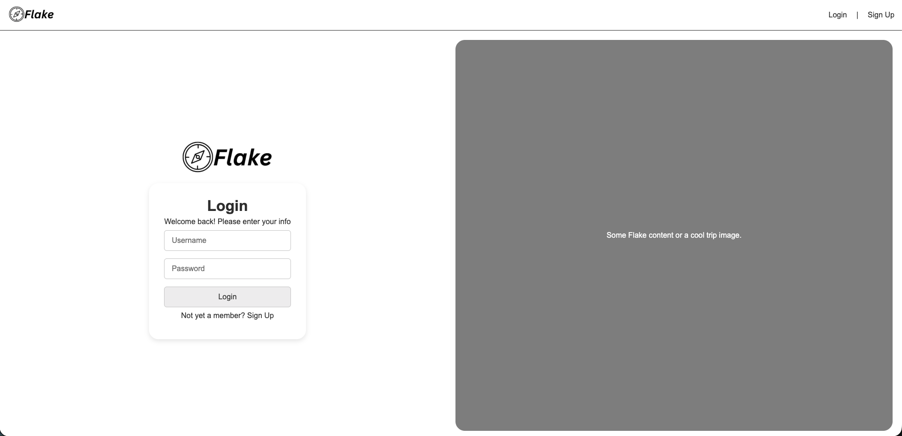
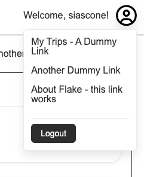
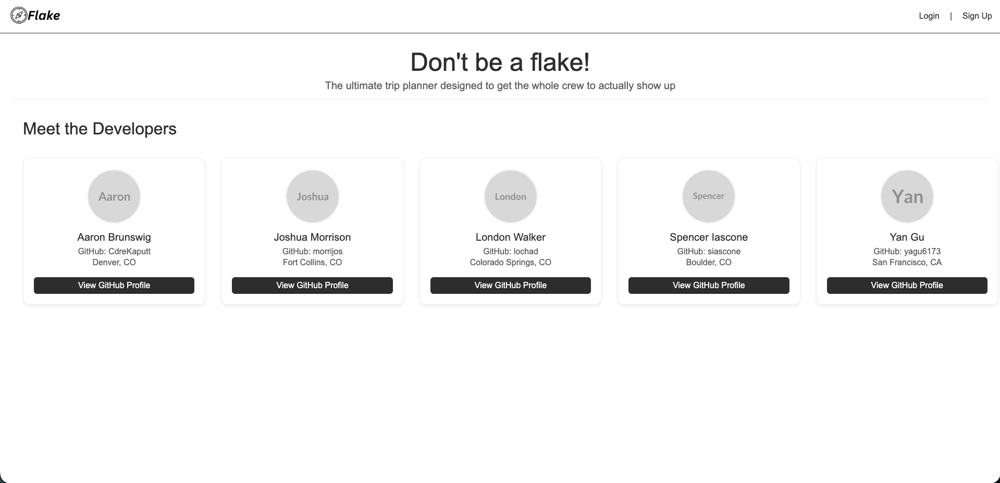
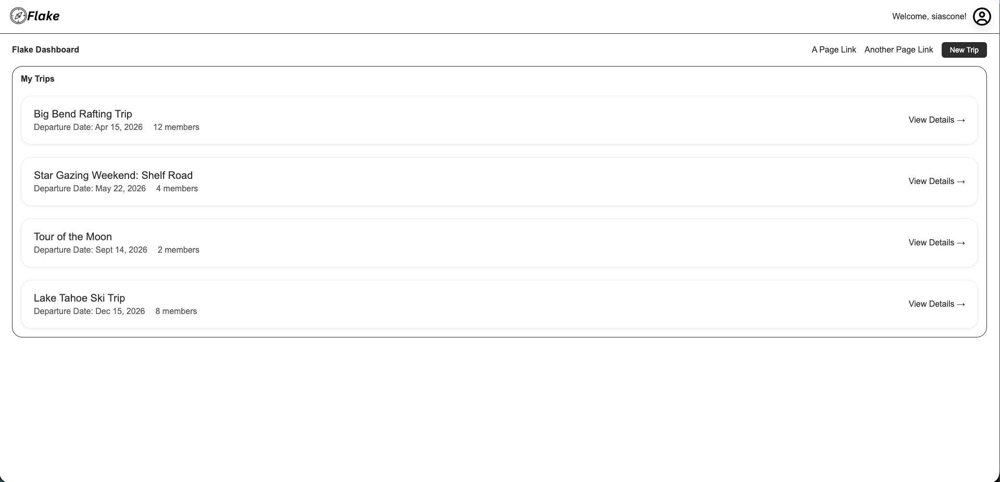
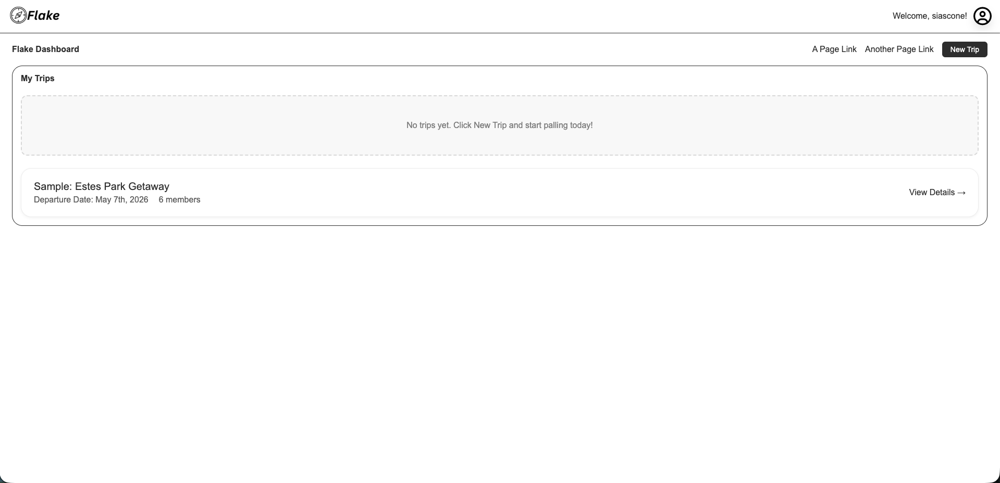
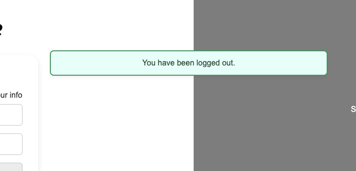
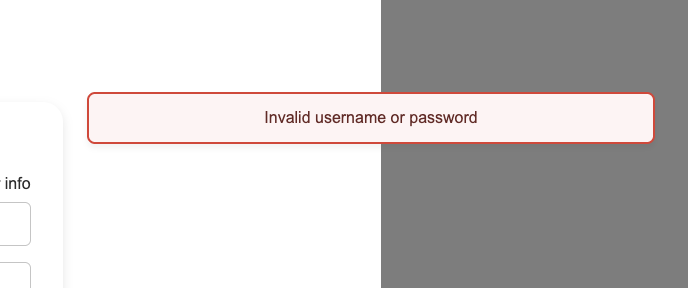
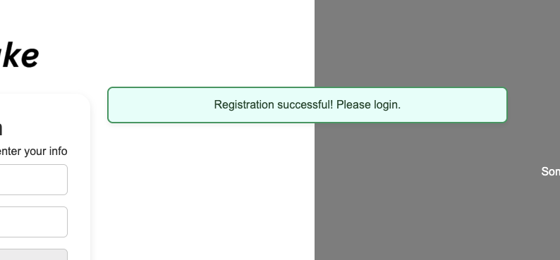
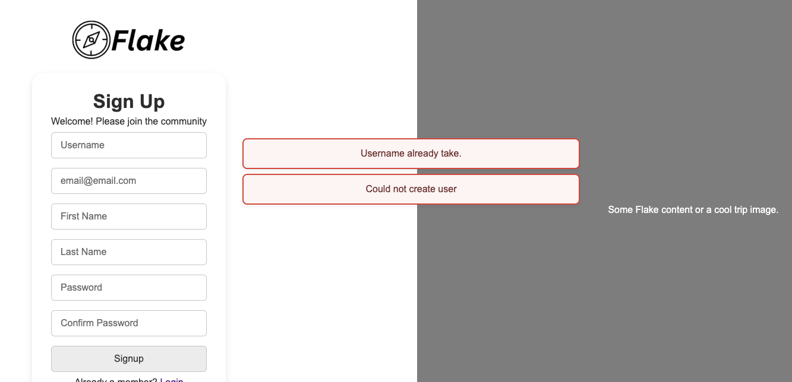
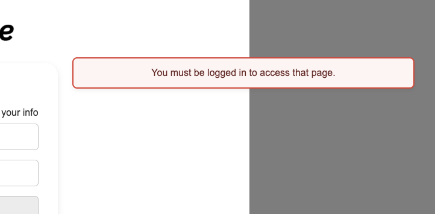

# Auth Views Overview

This document outlines the authentication-driven navigation and landing page logic for the **Flake** app.

## 1. Landing Page Logic
By default, the application lands the user on the Login page.

* **Login View**: The primary entry point for returning users.


### Navigation Bar States
The navigation bar is dynamic and changes based on the user's authentication status.

#### Logged Out State
When no user is in the session, the nav bar provides a call to action for logging in or signing up. 
* **Links**: Login and Sign Up.
* 

#### Logged In State
When a session is active, the auth links are replaced by personal user controls.
* **Greeting**: Displays "Welcome, [Username]!".
* 
* **User Dropdown**: A hoverable icon that reveals a menu of placeholder links.
    - Note "About Flake" and "Logout" are functional at this time
* 

---

## 2. Logo Link Behavior
The "Flake" logo in the top-left corner serves as a contextual home button. Its destination depends on whether or not the user is logged in.

| User State | Destination | Description | Image Reference |
| :--- | :--- | :--- | :--- |
| **Logged Out** | **About Page** | Explains the app's purpose and introduces the developers. |  |
| **Logged In** | **Dashboard** | Directs the user to their personal trip index. |  |

---

## 3. The Dashboard
The goal of the Dashboard page is to provide the user with an access point to their
list of trips as well as the ability to access creating a New Trip
- Note the New Trip button in the upper right corner (this is a dead button at this time)
- Currently the Dashboard displays a list of dummy trips for any logged in user
    - This will be replaced with actual trip data once the trip model, db table and routes are complete
- When a user is new to the site and is not a memver of any trips the dashboard displays
  "No Trips yet. Click New Trip and start planning today!" as well as provieds a sample 
  trip item below. 

* **Dashboard with Trips**


* **Dashboard without Trips**


## 4. Error and Success Messages
The flash object is used to dynamically send error or success messages depending on the
route being accessed. The messages div lives on the center of the page and only displays
where there are messages in the flash object (see `templates/home.html lines 56-66`).

Based on the category of messages (error, all others) the messages div sytle changes
- Red for errors, green for all else
- See `static/css/style_sheets/messages.css`

Here are some examples:
**Logout Success**



**Login Error** 



**Signup Success** 



**Signup Error** 



**Protected Routes** 




## 5. Logic Changes
NOTE: All changes listed below are aime to prioritize eaze of development in alignment 
with the material we are learning in class as well as respect the reality of the
limited time each team member has to commit to this project each week. All changes
from the previous version of the app are not perminent and can be reversed when
we get to our Reach Goal, a React Frontend.

As we have decided to move forward with the Jinja based templates that we have 
been learning in class as the basis for our views the following changes have been
made to the auth pattern.
- Comment out returns of JSON objects
    - Note: these have not been removed, just commented out so they can be
      leveraged if we make it to our reach goal of a React Frontend
- Returned JSON objects have been replaced with either
    - render_template
    - redirect(url_for('...'))
- For the time being JWT tokens are not in use as we are not currently doing 
  frontend rendering of views (i.e React)
    - This logic has not been removed so that it can easily be leveraged if we 
      make it to our reach goal of a React Frontend
    - CSRF Tokens (Cross Site Request Forgery Token) have been enable in their 
      place so that protected routes can be secure
        - for any route we make that receives anything other than a `GET` request
          we simply add the following hidden input to any form that will be 
          making the request to those routes (flask's built in middleware will handle the decoding of the csrf_token for us)
          ```html
            <input type="hidden" name="csrf_token" value="{{ csrf_token() }}">
          ```
- Use of `session` object
    - In order to identify the logged in user a `'user'` key is being added to 
      the flask `session` object upon login and removed upon logout. 
        - Currently this `session['user']` key only points to the `username` of a
          logged in member. We can update this at a later time to include more
          user details such as Frist Name, Last Name, user_id etc.

## 6. State of the app and next steps

At this moment the app is functional and usable for signup, 
login, logout, dashboard viewing and an about page that has our team's info on it. 

The pages are designed as dynamic jinja templates that have embedded python for conditional
rendering. All pages inherit from a "home" page that houses the nav bar. These types of 
pages will accept variable inputs from any db calls we make and pass to render_template.

There is a rudamentry error handling set up using the `flash` object from Flask, however the styling of these errors needs to be updated.
- currently errors render at the bottom of the page, they need to be moved higher up,
  idealy positioned around the form that would trigger them in the event of an error.

As for next steps:
- DONE -> Some quick styling on the errors, I can handle this tomorrow Sunday, March 15th
- A Pull Request and team review
- Merge to main
- Write up of a feature development procedure: 
    - `model -> migration -> tests -> routes -> tests -> templates -> tests -> repeat`
    - I'll start working on this tomorrow Sunday, March 15th
- Feature assignments to team members
    - Team members cut feature branches for their perspective feature and begin 
      coding on their part of a feature
        - backend (model, migration, routes)
        - frontend (templates)


## 7. Getting the project running
Currently the entirety of the app lives in a folder called `backend`. This was 
originally set up as we planned to have a React frontend decoupled from the backend. 
For now we can keep it this way and just work out of the `backend` folder. 
- The app still has a level of decoupling as there are api sepcific routes (located 
in `backend/app/api/.../`) that strictly deal with database access. And there are 
"frontend" routes, non-api routes (located in `backend/app/routes/`) that deal with
rendering templates (i.e. frontend views, forms ect.)

To prepare your local version do the following:
1. Pull down remote branch
    - save any changes you have on your local repo and current branch
    - run `get checkout auth-templates`

2. App Setup:
    - Open a new terminal
    - run `cd backend`
    - create a `venv` folder by running
        - `python -m venv venv`
    - (optional) start your vitural enviroment (venv) with
        - `. ./venv/bin/activate`
        - note if you do not have execute permissions change the mode of the 
          activate file by running 
            - `chmod +x venv/bin/activate`
            - you should now be able to run your virtual environment with the `. ./venv/bin/activate` command 
    - run `pip install -r requirements.txt`
    - Make a `.env` file in the `backend/` folder by running 
        - `touch .env`
        - Add these keys to the `.env` file:
            - DEV_DATABASE_URL=sqlite:///dev.db
            - JWT_SECRET_KEY=some_random_string_of_letters_and_numbers
            - SECRET_KEY=some_other_random_string_of_letters_and_numbers
    - run `flask db upgrade` to setup the database with the current migrations
3. Start the app:
    - run `flask run`
    - navigate to [http://localhost:8000/](http://localhost:8000/) and test it out
4. Reach out on slack if you run into any trouble.