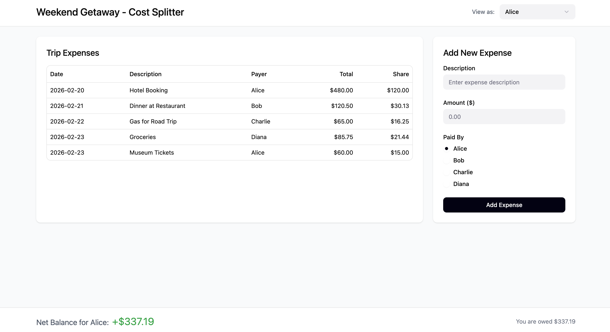

# User Stories, DB Relations and ASCII Wireframe for Cost Splitter feature

## User Stories

### 1: Adding an Expense (MVP)
**As a**: Trip member

**I want**: To enter a total expense amount and description

**So that**: The group knows how much was spent and on what.

#### Effort Level: ?

#### Acceptance Criteria: 

**Given**: I am on the Cost Splitter page for a specific trip.

**When**: I input an amount (e.g., $100) and a description (e.g., "Gas, ARCO on 2-22-26").

**Then**: The system saves the expense and associates it with my user ID as the "payer."

---

### 2: Automatic Even Split (MVP)
**As a**: Trip member

**I want**: The system to automatically divide the cost by the number of trip participants

**So that**: I don't have to do the math myself for shared costs.

#### Effort Level: ?

#### Acceptance Criteria: 

**Given**: An expense of $90 is added to a trip with 3 members.

**When**: The expense is saved.

**Then**: The system creates 3 records in the `splits` table, each assigned $30 to a different member.

---

### 3: Balance Overview (MVP)
**As a**: Trip member

**I want**: To see a summary of who owes how much to whom

**So that**: We can settle up at the end of the trip.

#### Effort Level: ?

#### Acceptance Criteria:

**Given**: Multiple expenses have been logged.

**When**: I view the "Overview" section.

**Then**: I see a "Net Balance" (e.g., "You are owed $20" or "You owe $15" including who owes whom what).

---

### 4: Custom Allocation (Reach Goal)
**As a**: Trip member

**I want**: To "claim" a specific expense or adjust the split percentages

**So that**: Costs like individual meals or specific gas runs are accurately reflected.

#### Effort Level: ?

#### Acceptance Criteria:

**Given**: A $50 gas expense exists.

**When**: I select "Individual Claim" for that expense.

**Then**: The system updates the Expense_Splits so that I owe $50 and all other trip members owe $0 for that specific item.

---

### 5: Real-time Updates (MVP)
**As a**: Developer

**I want**: The UI to recalculate totals immediately after an expense is deleted or edited

**So that**: Users always see the most accurate financial data.

#### Effort Level: ?

#### Acceptance Criteria:

**Given**: An existing expense of $60.

**When**: I change the amount to $90.

**Then**: The "Net Balance" for all trip members updates instantly without a full page refresh.

---

### 7. Member Departure Logic (Someone "Flaked") (MVP)
**As a**: Developer

**I want**: The system to recalculate or archive splits when a member is removed from a trip

**So that**: The remaining members' balances are accurate and don't include a "ghost" debtor.

#### Effort Level: ?

#### Acceptance Criteria:

**Given**: A $100 expense is split between 4 people ($25 each).

**When**: One member is removed from the trip.

**Then**: The system deletes that member's Expense_Splits records and updates the remaining 3 members to owe $33.33 each (plus or minus a penny).

---

### 8. Payer Credit Logic (Reach Goal)
**As a**: Developer

**I want**: The payer_id to be excluded from the "owe" calculation for a specific expense

**So that**: The person who paid doesn't appear to owe themselves money in the balance sheet.

#### Effort Level: ?

#### Acceptance Criteria:

**Given**: User A pays $100 for a trip with Users A, B, and C.

**When**: The split is calculated.

**Then**: User B and User C each have an Expense_Splits record for $33.33, but User A has $0 owed (or no record) because they already paid the full $100.

LOGIC NOTE: When generating splits, the system should only create amount_owed records for Memberships.member_id != payer_id.

---

### 9. Pre-Trip Budgeting (Reach Goal)
**As a**: Developer

**I want**: To allow expenses to be added with an is_paid = False flag and no payer_id

**So that**: Users can see projected costs and budget accordingly before anyone actually spends money.

#### Effort Level: ?

#### Acceptance Criteria:

**Given**: The group is planning a trip and expects a rental car to cost $300.

**When**: A user adds this as an "Estimate" (is_paid = False).

**Then**: The system splits the $300 evenly across all members in the splits table so everyone sees a "Projected Debt" of $100.

---

## Anticipated Minimum Relations:

### trips

| Column Name   | Datatype        | Constraint/Description              |
|---------------|-----------------|-------------------------------------|
| `id`          | `INT`           | Primary Key, Not Null               |
| `trip_name`   | `VARCHAR(255)`  | not null, Name of trip              |
| `start_date`  | `DATE`          | not null, Start date of trip        |
| `end_date`    | `DATE`          | not null, End date of trip          |
| `created_at`  | `TIMESTAMP`     | Default CURRENT_TIMESTAMP           |
| `updated_at`  | `TIMESTAMP`     | Default CURRENT_TIMESTAMP on update |

### users

| Column Name  | Datatype       | Constraint/Description              |
|--------------|----------------|-------------------------------------|
| `id`         | `INT`          | Primary Key, Not Null               |
| `username`   | `VARCHAR(50)`  | Not Null, Unique                    |
| `email`      | `VARCHAR(100)` | Not Null, Unique                    |
| `first_name` | `VARCHAR(100)` | Not Null                            |
| `last_name`  | `VARCHAR(100)` | Not Null                            |
| `created_at` | `TIMESTAMP`    | Default CURRENT_TIMESTAMP           |
| `updated_at` | `TIMESTAMP`    | Default CURRENT_TIMESTAMP on update |

### memberships (joins table between trips and users)

| Column Name    | Datatype    | Constraint/Description              |
|----------------|-------------|-------------------------------------|
| `id`           | `INT`       | Primary Key, Not Null               |
| `trip_id`      | `INT`       | Foreign Key (Trips.id), Not Null    |
| `member_id`    | `INT`       | Foreign Key (Users.id), Not Null    |
| `created_at`   | `TIMESTAMP` | Default CURRENT_TIMESTAMP           |
| `updated_at`   | `TIMESTAMP` | Default CURRENT_TIMESTAMP on update |

### expenses

| Column Name        | Datatype       | Constraint/Description                                    |
|--------------------|----------------|-----------------------------------------------------------|
| `id`               | `INT`          | Primary Key, Not Null                                     |
| `trip_id`          | `INT`          | Foreign Key (Trips.id), Not Null                          |
| `payer_id`         | `INT`          | Foreign Key (Users.id), Not Null                          |
| `amount`           | `FLOAT`        | Not Null, Total cost of the item                          |
| `description`      | `VARCHAR(255)` | Not Null, (ex: Gas, ARCO on 2/22/26)                      |
| `is_paid`          | `BOOLEAN`      | Default False, True if a member has already paid in full  |
| `expense_type`     | `VARCHAR(20)`  | Not Null, 'actual' (paid), 'estimate' (pre-trip budgt)    |
| `created_at`       | `TIMESTAMP`    | Default CURRENT_TIMESTAMP                                 |
| `updated_at`       | `TIMESTAMP`    | Default CURRENT_TIMESTAMP on update                       |

### splits

| Column Name   | Datatype    | Constraint/Description                                                 |
|---------------|-------------|------------------------------------------------------------------------|
| `id`          | `INT`       | Primary Key, Not Null                                                  |
| `expense_id`  | `INT`       | Foreign Key (Expenses.id), Not Null                                    |
| `member_id`   | `INT`       | Foreign Key (Users.id), Not Null                                       |
| `amount_owed` | `FLOAT`     | Not Null, Member portion of expense - Total Expense / num members - 1  |
| `created_at`  | `TIMESTAMP` | Default CURRENT_TIMESTAMP                                              |
| `updated_at`  | `TIMESTAMP` | Default CURRENT_TIMESTAMP on update                                    |

NOTE: This one will be tricky, calculated when expense is added, updated when a 
      member flakes on trip 

## Wireframe

NOTE: Mocked up with figma starter via provided description:

"Can you please create a web dashboard for a trip expense manager (Cost Splitter) page for a trip planner app. Top header with trip name and trip member dropdown. Main area is a 75% width table showing expenses with columns for Date, Description, Payer, Total, and Share. Right sidebar is a 25% width form to add a new expense with a description field, amount field, and radio buttons for payer choice. Add a sticky footer at the bottom showing a 'Net Balance' total."

[Link to Interactive Version](https://sadly-marsh-71837886.figma.site/)

